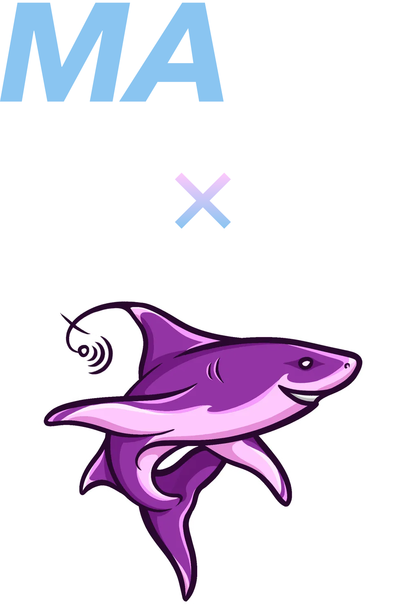
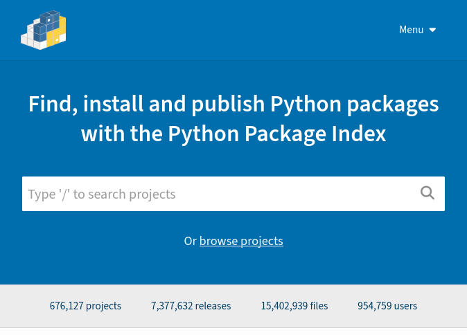

<!-- _class: invert -->



`MACS × MQCyber`
# **Python Workshop (Beginner)**

18 Sep. 2025
Jahin Z.

---

## `whoami`

Hi! I'm Jahin! <sup>(he/him)</sup>

- Bachelors of IT (Software Technology) (2025)
- Writing Python since 2019
- Made a lot of cool stuff in Python:
  - `rozelle` - a code exercise runner and builder
  - `yfie` - make Wi-Fi connection QR codes
  - `tabbycat` - pretty print CSVs in the terminal

- Website: [jahinzee.github.io](https://jahinzee.github.io)

---

## Today's schedule

- **17:00**
  - Setting up our environment
  - Learning Python basics
- **18:00**
  - 30 minute break (and refreshments!)
- **18:30**
  - Building a full Python app, with libraries!
- **19:30**
  - Wrapping up and Q&A

---


## What is Python?

* High-level dynamic general-purpose language
* Created by Guido van Rossum
* History:
  - Python 1 (1994)
  - Python 2 (2000)
  - Python 3 (2008, latest: 3.13)
* Named after Monty Python

<!--
- Sources:
  - https://upload.wikimedia.org/wikipedia/commons/c/c3/Python-logo-notext.svg 
  - https://www.python.org/download/releases/ (Python 1.0.1 documentation)
  - https://docs.python.org/3/license.html
  - https://docs.python.org/3/whatsnew/3.0.html
-->

---

<!-- _class: invert -->


<!--
- Attribution:
  - https://imgflip.com/i/3gn5us: Monty Python's Flying Circus, © BBC
-->

---

## Why Python?

- Simple syntax, easy to pick up
- Very convenient for small programs and quick scripts
  ```py
  def sum_even_numbers(start: int, end: int) -> int:
      output = 0
      for i in range(start, end + 1):
          if n % 2 == 0:
              output = output + n
      return output
  ```
* “*It is also a handy desk calculator.*” –docs.python.org
  ```python
  >>> 32 * 62
  1984
  ```

<!--
- Sources:
  - https://docs.python.org/3/tutorial/appetite.html

- Python can be run in a REPL (read-eval-print-loop)
  - Rapid prototyping and testing

-->

---

## The Zen of Python

<style scoped>section {font-size: 1.5rem !important;}</style>

```
>>> import this
The Zen of Python, by Tim Peters

Beautiful is better than ugly.
Explicit is better than implicit.
Simple is better than complex.
Complex is better than complicated.
Flat is better than nested.
Sparse is better than dense.
Readability counts.
Special cases aren't special enough to break the rules.
Although practicality beats purity.
Errors should never pass silently.
Unless explicitly silenced.
In the face of ambiguity, refuse the temptation to guess.
There should be one-- and preferably only one --obvious way to do it.
Although that way may not be obvious at first unless you're Dutch.
Now is better than never.
Although never is often better than *right* now.
If the implementation is hard to explain, it's a bad idea.
If the implementation is easy to explain, it may be a good idea.
Namespaces are one honking great idea -- let's do more of those!
```

<!--
- You can read the Zen of Python by running `import this` in a file or a REPL.
-->

---

## Why Python? (continued)

- Extensive **built-in** standard library:
  - `json`: load and save JSON objects
  - `csv`: load and save CSV files
  - `requests`: lightweight HTTP server
  - `tkinter`: make quick desktop GUIs
  - `argparse`: parse command-line arguments
  - `multiprocessing`: do many things at once
  - `sqlite3`: lightweight SQL-like databases


<!-- 
- Sources:
  - https://docs.python.org/3/library/index.html
- Attributions:
  - https://xkcd.com/353: xkcd, Randall Munroe

-->

---

## Why Python? (continued)

- Massive **third-party** library ecosystem:
  - Web development: `django`, `FastAPI`
  - Game development: `pygame`, `pyglet`
  - Scientific computing: `numpy`, `pandas`, `scipy`
  - Machine learning: `tensorflow`, `pytorch`
  - Cybersecurity tools: `scapy`, `nmap`
- …and a lot more on [pypi.org](https://pypi.org)



<!--
- Sources:
  - https://pypi.org/
  - https://www.python.org/about/apps/
  - https://www.geeksforgeeks.org/python/python-for-cybersecurity/ 
-->

---

## Getting Started

**uv + Python**

- **uv**: Installs and manages different Python versions and project dependencies
- Install uv from [docs.astral.sh/uv](https://docs.astral.sh/uv)…
  - …then install Python: `uv python install`

**Visual Studio Code**

- Install from [code.visualstudio.com](https://code.visualstudio.com)
- **Extensions**: Run these in the VSCode run box (`Ctrl`/`⌘` + `P`) to install:
  - Python Language Support: `ext install ms-python.python`
  - (optional) Ruff - linter and formatter: `ext install charliermarsh.ruff`

---

## Getting Started (continued)

**Project Setup**

- Create a new folder somewhere to put your Python project, and open VS Code to that folder.
- Open the terminal (`Ctrl`/`⌘` + <code>\`</code>) and run `uv init .`

- Open the newly created `main.py` file.

**Important Commands**

- `uv run main.py`: execute your Python code
- `uv venv`: create a virtual environment to store dependencies
- `uv add ...`: install packages to your project


---

<!-- _class: invert -->

# Let's-a-go!

---

## Hello, World!

- Print output to console:
  ```py
  print("Hello World!")
  ```

- Request input from console (with a message):
  ```py
  user_name = input("What's your name? ")
  print(f"Hello, {name}!")
  ```

---

## Variables and types

- No need to write out the types, it can be inferred:
  ```py
  foo = 42          # type: int
  bar = "mars bar"  # type: str
  eggs = 36.60      # type: float
  spam = True       # type: bool
  ```

* Convert between types by using it as a function
  ```py
  foo = "900"         # type: str
  bar = int("900")    # type: int
  baz = int("nope!")  # ValueError: invalid literal for int() with base 10: 'nope!'
  ```

<!-- 
- You can optionally annotate types, more on that later.
-->

---

## Number operations

- Arithmetic operations:
  ```py
  1 + 1    # 2
  3 - 5    # -2
  80 * 20  # 1600
  ```
* Integer *vs.* float division:
  ```py
  5 / 3    # 1.666…
  5 // 3   # 1
  ```

---

## Number operations (continued)

- *Modulo* operation to get the remainder:
  ```py
  5 % 3  # 2
  div, mod = divmod(5, 3)  # div: 1, mod: 2
  ```

* Numeric comparisons:
  ```py
  60 <= 100  # False
  8 == 8     # True
  ```

<!-- 
- divmod returns a tuple of stuff, again, more on that later.
-->

---

## String interpolations

- *f-strings*: interpolate variables inside strings. Prefix `f` before the first quote mark:
  ```python
  name = "Yoshikage Kira"
  print(f"My name is {name}.")
  # My name is Yoshikage Kira.
  ```

---

## `EXERCISE:` Year Calculator

Write a program that asks for the user's name and how many years they have been in uni for.
Use this information to print out their name and calculated start yearin this format:

> My name is `name`. I have been in uni since `start_year`.

* **Example Code**
  ```py
  name = input("What's your name? ")
  years_studying = input("How long have you been in uni for (in years)? ")

  start_year = 2025 - int(years_studying)

  print(f"My name is {name}. I started studying at uni in {start_year}.")
  ```

<!--

- `input()` returns answers as strings, so we'll need to convert it into an int.

-->

---

## Booleans

- Always capitalised:
  ```python
  True and False  # False
  True or False   # True

  not True  # False
  ```

---

## if/elif/else statements

- **Note**: it's `elif`, not `else if`:
  ```py
  name = input("What's your name? ")

  if name == "Mallory":
      print("Intruder spotted")
  elif name == "Admin":
      print(f"Hello, {name}! The secret password is ********.")
  else:
      print(f"Hello, {name}!")
  ```

* Note the **significant whitespace** (a.k.a. the *off-side* rule)
  - Code blocks are seperated by how much they are *indented*
  - 1 level = 4 spaces 
  - In **Java**, you'd do this with curly braces `{`/`}`

---

## Lists

- Editable collections of data.
* Access items and *slices* (sublists):
  ```py
  shopping_list = ["eggs", "milk", "bread", "shrek_2"]

  shopping_list[0]   # eggs
  shopping_list[-1]  # shrek_2

  shopping_list[1:]   # ["milk", "bread", "shrek_2"]
  shopping_list[1:3]  # ["milk", "bread"]
  
  len(shopping_list)  # 3
  ```

* Lists can be edited:
  ```py
  shopping_list[2] = "pasta"
  shopping_list.append("hundreds_and_thousands")
  # ["eggs", "milk", "pasta", "shrek_2", "hundreds_and_thousands"]
  ```

<!-- 
- Slicing:
  - You can omit either boundary:
    - shopping_list[1:] -> 1 to the end of the list 
    - shopping_list[:2] -> start of list to 
-->

---

## Strings

- Strings can be concatenated, multiplied and compared:
  ```py
  "hello " + "world!"   # "hello world!"
  "hi" * 5              # "hihihihihi"
  
  "HAL" == "IBM"  # False
  "HAL" < "IBM"   # True
  ```

* You can slice strings like lists of characters:
  ```py
  "hello world!"[0]    # "0"
  "hello world!"[-1]   # "!"
  "hello world!"[4:8]  # "o wo"
  ```

---

## Sets

- Collections of *unique* values of the same type:
  ```py
  favourite_numbers = {1, 2, 3, 7, 9, 10}
  ```

* Converting a list to a set filters out duplicates:
  ```py
  boring_numbers = set([4, 5, 5, 6, 6, 8])
  # boring_numbers == {4, 5, 6, 8}
  ```

* **Note:** sets cannot contain *mutable* things, such as lists or nested sets.

---

## Sets (continued)

- Use `in` to check if an element is in a set (this also works with lists):
  ```py
  11 in favourite_numbers  # False
  5 in boring_numbers      # True
  ```

* `|` merges two sets (removing duplicates):
  ```py
  merged = favourite_numbers | boring_numbers
  # merged == {1, 2, 3, 4, 5, 6, 7, 8, 9, 10}
  ```

* Cannot be indexed or sliced, they don't store their members in any defined order:
  ```py
  my_set = {1, 2, 3}
  my_set[0]  # TypeError: 'set' object is not subscriptable
  ```

---

## `EXERCISE:` Login System

Create a login system for a set of users and admins.
- First, ask for a username.
- If the user is the users set, greet them with their name.
- If the user is in the admin set, greet them with the first 3 letters of their name.
- Otherwise, say that they aren't authorised.

**Tip:** Use lists/sets and *string slices*.

---

## `EXERCISE:` Login System (continued)

- **Example Code**
  ```py
  users = {"Alice", "Bob", "Carol"}
  admins = {"David", "Evelyn"}

  name = input("What's your name? ")
  if name in users:
      print(f"Hello, {name}!")
  elif name in admins:
      print(f"Hello, {name[0:3]}! You are an admin.")
  else:
      print("You are not authorised to log in.")
  ```

---

## Aside: Lists vs. Sets

- `list`:
  - Can storing *mutable* objects, such as sublists, dictionaries, and class objects
  - Stores things in a set order that can be indexed
  - Searching operations (i.e. with `in`) are overall slower
- `set`:
  - Can only store *immutable* objects
  - Some operations such as checking if a thing exists are overall faster
  - Automatically removes duplicates

This won't be on the test\*, just some geeky information :)

<!--

- There is no test anyway, lol
- Use sets if you're working with a series of simple data types and you don't care about
  duplicates or exact ordering
  - Some operations (especially `in`) can be a lot faster with sets, esp if you have a lot of things
-->

---

## Dictionaries

- A *mapping* of keys to values, like Java's `HashMap`s.
  ```py
  en_to_fr = {
      "red": "rouge",
      "green": "vert",
      "yellow": "jaune"
  }
  ```

* Use square brackets to insert and retrieve elements.
  ```py
  en_to_fr["red"]  # "rouge"

  en_to_fr["blue"] = "azure"
  # en_to_fr == {..., "blue": "azure"}
  ```

---

## Dictionaries (continued)

- Keys must be *immutable* (like sets) but values don't have to be.
  ```py
  definitions = {
    "python": ["a type of snake", "a programming language"],
    "java": ["an island of Indonesia", "a type of coffee", "a programming language"]
  }
  ```

* Use `in` to check a dictionary's *keys* (left side).
  ```py
  "yellow" in en_to_fr  # True
  "purple" in en_to_fr  # False
  ```

---

## `EXERCISE:` Login System v2

Use a dictionary to store a list of username and password\* mappings, and request them from the user.
If the username doesn't exist in the dictionary, print an appropriate error message.
If the username exists but the password doesn't match, print a different error message.
Otherwise, greet the user.

**\*:** You shouldn't store a password like this in the real world - this is just an example.

- You can the following user list:
  ```py
  users = {
      "Alice": "hunter2",
      "Carol": "Jh7H5^$21#VVLQdF",
      "Bob": "pizza"
  }
  ```

**Tip:** You can use `not in` to check if something is not in a set/list/dictionary.

<!--

```py
users = {
    "Alice": "hunter2",
    "Carol": "Jh7H5^$21#VVLQdF",
    "Bob": "pizza"
}
```
-->

---

## `EXERCISE:` Login System v2 (continued)

- **Example Code**
  ```py
  users = {
    "Alice": "hunter2",
    "Carol": "Jh7H5^$21#VVLQdF",
    "Bob": "pizza"
  }

  username = input("Username: ")
  password = input("Password: ")

  if username not in users:
      print("User not found.")
  elif users[username] != password:
      print("Incorrect password.")
  else:
      print(f"Welcome, {username}!")
  ```

---

## *while* loops

- Do something continuously until the value is `False`:
  ```py
  todo_list = ["smash the pots", "save hyrule", "vacation in delfino island"]

  while len(todo_list) != 0:
      task = todo_list.pop()  # Removes the last item from list, and returns it.
      print(f"Doing task: {task}... done!")

  # Doing task: vacation in delfino island... done!
  # Doing task: save hyrule... done!
  # Doing task: smash the pots... done!
  ```

---

## *for* loops

- Works slightly differently, operates on *iterator* types:
  - *iterator*: a Python object that you can sequentially walk through
  ```py
  # range(n): iterates through numbers 0 to n-1
  for i in range(10):
      print(i)

  # 0
  # 1
  # ...
  # 9
  ```

* You can iterate through lists, dictionaries, sets, strings, and many other things!

---

## *for* loops (continued)

- Iterate over lists:
  ```py
  list = ["eggs", "spam", "foo", "bar"]
  for element in list:
      # end=' ': don't put a newline after it, instead put a ' '
      print(element, end=' ')  # eggs spam foo bar
  ```

* Iterate over lists with index:
  ```py
  for idx, element in enumerate(list):
      print(f"{idx}: {element}", end=', ')  # 0: eggs, 1: spam, 2: foo, 3: bar
  ```

* Iterate over dictionary keys and values:
  ```py
  frequencies = {"a": 1, "e": 3, "g": 2, "i": 1, ... }
  for character, frequency in users.items():
      print(f"{character} appears {frequency} time(s)", end=', ')
      # a appears 1 times(s), e appears 3 times(s), g appears 2 times, ...
  ```
  
---

## Functions

- Use the `def` keyword to define a function:

  ```py
  users = { "Alice": "hunter2", ... }

  def user_can_login(username, password):
      if username not in users:
          return False
      users[username] != password:
          return False
      return True

  user_can_login("Mallory", "fish")   # False
  user_can_login("Alice", "hunter2")  # True
  ```

---

## Type Annotations

- In Python, you do not *need* to specify types, but you can optionally specify them with *type annotations*:
  ```py
  def user_can_login(username: str, password: str) -> bool:
      ...
  ```

* Note that Python itself won't check if you're following the type annotations:
  - Python will still roll with it until it reaches an error with some internal operation.
  ```py
  user_can_login(325, ["2006 Subaru Impreza"])
  # Even though this doesn't follow the annotations, it'll still work.
  ```

* **duck typing**: "If it walks like a duck and it quacks like a duck, then it must be a duck"

* You can use external tools like `mypy` to prevalidate your Python types and usage ahead of time.

<!--
- Re: "rolling with it":
  - Say you have a function that adds two variables. It'll work with strings and ints since they
    can both be added.
  - If you have a function that substracts something, putting a string in will cause it to fail
    if you pass in a string, since that isn't a defined operation.

- Not covering mypy in this workshop.

def add(a, b):
    return a + b

def sub(a, b):
    return a - b

add(1, 2)          # 3
add("foo", "bar")  # foobar
sub(1, 2)          # -1
sub("foo", "bar")  # TypeError: unsupported operand type(s) for -: 'str' and 'str'

- Sources:
  - https://docs.python.org/3/glossary.html#term-duck-typing
-->

---

## `EXERCISE:`: FizzBuzz

Write a function that, given a number $n$, plays FizzBuzz for all numbers $0$ to $n$ (inclusive):
- If the number is divisible by 15: return "FizzBuzz"
- Else, if the number is divisible by 3: return "Fizz" 
- Else, If the number is divisible by 5: return "Buzz" 
- Otherwise, return the original number converted to a string.

**TIP:** $a$ is divisible by $b$ if $a\ \mathrm{mod}\ b = 0$. 

---

## `EXERCISE:`: FizzBuzz (continued)

- **Example Code**:
  ```py
  def fizzbuzz(n: int):
      for i in range(0, n+1):
          if i % 15 == 0:
              print("FizzBuzz")
          elif i % 3 == 0:
              print("Fizz")
          elif i % 5 == 0:
              print("Buzz")
  ```
---

## Tuples

- Like lists, but can't be directly modified after you create them.
- Immutable, can be placed inside sets and as dictionary keys.
- Useful for:
  - returning multiple values from a function,
  - using composite keys in a dictionary
  ```py
  tuple = (3, 6, 8, 5)
  result = divmod(6, 5)  # This is a tuple: (1, 1)
  ```

* Can also be *destructured* into multiple variables

  ```py
  output, remainder = divmod(6, 5)  # output = 1, remainder = 1 
  ```

<!-- 
- `enumerate()` from earlier also outputs tuples. 
-->

---

## Aside: Lists vs. Sets <span class="highlight">vs. Tuples</span>

- `list`:
  - Can storing *mutable* objects, such as sublists, dictionaries, and class objects
  - Stores things in a set order that can be indexed
  - Searching operations (i.e. with `in`) are overall slower
- `set`:
  - Can only store *immutable* objects
  - Some operations such as checking if a thing exists are overall faster
  - Automatically removes duplicates
- `tuple`:
  - Like lists, they store things in an order, and can contain mutable stuff
  - Unlike lists, cannot be modified after you created them
  - Immutable (unless it contains mutable things inside it)

This won't be on the test\*, just some geeky information :)

---

## Classes

- Python is **object-oriented** – you can create and initialise classes:
  ```py
  class Vehicle:
      license_plate: str
      top_speed: str

      def __init__(self, license_plate: str, top_speed: str) -> None:
          self.license_plate = license_plate
          self.top_speed = top_speed
      
      def drive(self):
          print(f"Zooming around at {self.top_speed} km/h...")

  macsmobile = Vehicle("MACS 01", 120)
  macsmobile.drive()  # Zooming around at 120 km/h...
  ```
  * `__init__` (pronounced: "dunder init") specifies a constructor
  * Instance methods have an implicit `self` parameter (equivalent to Java's `this`)

<!--
- dunder:
  - In Python jargon, "dunder something" means "__something__"
- `self`:
  - Technically you can use any name, but `self` is the common convention.
-->

---

## Classes (continued)

- Inheritance is also supported:
  ```py
  class Car(Vehicle):
      is_electric: bool

      def __init__(self, license_plate: str, top_speed: str, is_electric: bool) -> None:
          super().__init__(license_plate, top_speed)
          self.is_electric = is_electric
      
      def refuel(self):
          if self.is_electric:
              print("Refuelling with the power of lightning")
          else:
              print("Refuelling with the power of plant juice")

  macsmobile = Car("MACS 01", 120, True)
  macsmobile.drive()   # Zooming around at 120 km/h...
  macsmobile.refuel()  # Refuelling with the power of lightning
  ```
  * `super()` returns the parent class (or sibling, in the case of multiple inheritance)

---

## Importing

- Import whole modules…
  ```py
  import math
  math.pow(2, 5)  # 32.0
  ```
* …or just individual functions from a module:
    ```py
  from math import pow
  pow(2, 5)  # 32.0
  ```

---

## Dataclasses

- Write simple classes much quicker!
  ```py
  from dataclasses import dataclass

  @dataclass
  class Vehicle:
      license_plate: str
      top_speed: str
      # __init__ automatically written for us by @dataclass :D
      def drive(self):
          print(f"Zooming around at {self.top_speed} km/h...")

  macsmobile = Vehicle("MACS 01", 120)
  macsmobile.drive()  # Zooming around at 120 km/h...
  ```
* Can make classes immutable → store them in sets and dictionary keys!
  ```py
  @dataclass(frozen=True)
  class Vehicle:
      ...
  ```

---

<!-- _class: invert -->

# And that's a whirlwind tour of Python!

<!-- might be a good time for the break? -->
<!-- TODO -->